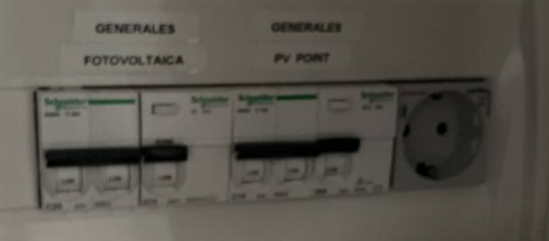
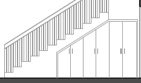
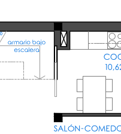
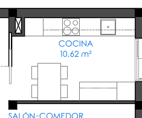
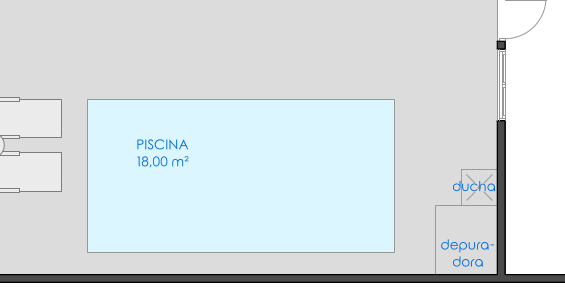
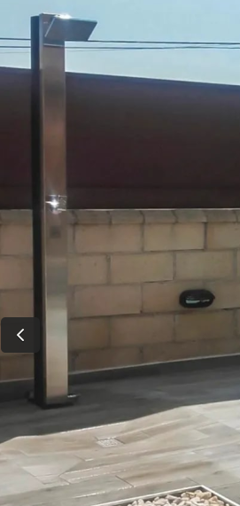

<!-- TOC -->

- [Dudas generales](#dudas-generales)
- [Planta baja](#planta-baja)
  - [General](#general)
    - [Dudas](#dudas)
  - [Patio delantero](#patio-delantero)
    - [Dudas](#dudas-1)
  - [Recibidor](#recibidor)
    - [Dudas](#dudas-2)
  - [Estudio](#estudio)
  - [Baño planta baja](#baño-planta-baja)
  - [Salón](#salón)
    - [Dudas](#dudas-3)
  - [Cocina](#cocina)
    - [Dudas](#dudas-4)
  - [Terraza trasera](#terraza-trasera)
    - [Dudas](#dudas-5)
  - [Piscina/Jardin](#piscinajardin)
    - [Dudas](#dudas-6)
  - [Trastero](#trastero)
    - [Dudas](#dudas-7)
- [Planta alta](#planta-alta)
  - [General](#general-1)
  - [Matrimonio](#matrimonio)
    - [Baño insuite](#baño-insuite)
  - [Baño de servicio](#baño-de-servicio)
  - [Habitacion junto matrimonio](#habitacion-junto-matrimonio)
  - [Habitación sobre estudio](#habitación-sobre-estudio)
  - [Habitacion sobre entrada](#habitacion-sobre-entrada)
- [Tejado](#tejado)
  - [Dudas](#dudas-8)

<!-- /TOC -->

# Dudas generales

- ❓ Domótica

# Planta baja

## General

- ✔️ Airzone planta baja

### Dudas

- ❓ Foseado led con llave adicional en pasillos

## Patio delantero

- ✔️ Puerta de garaje automática
- ✔️ Toma de manguera
- ✔️ Enchufe exteriores
- ✔️ Preinstalación para poner cargador de coche eléctrico (corrugado hasta el cuadro, etc.). Punto cerca del medio de la fachada, centrado en la zona de aparcamiento.
- ✔️ Descalcificador
- ✔️ Caja estanca en techo porche delantero, esquina más cercana a puerta entrada de la calle
  - ✔️ Cable RJ45 dentro de la caja estanca hasta el switch

### Dudas

- ❓ Tamaño y ubicación de descalcificador
- ❓ La puerta automática lleva sensor para no cerrarse si hay vehiculo pasando?

## Recibidor

- ✔️ Cajas muy grandes para cuadro eléctrico
  - Con espacio para electrónica de red (conversor de medios, router operadora, router, switch, etc)
  - Enchufe en rail para poder conectar una regleta con los dispositivos anteriores
    - 
  - Conexión a la red telefónica RJ11 de la casa (para conectar al router)
- ✔️ Armario bajo escalera
- ✔️ Toma RJ45 en techo junto a escalera hacia zona salón para AP
- ✔️ 🔌 Enchufe en la parte baja de la pared alineada con la puerta (aspirador)
- ✔️ Enclufe incluido (lámpara)
- ✔️ Videoportero con Wifi

### Dudas

- ❓ Puerta única o varias como dibuja Elena en el armario
  - 
  - Posibilidad de módulo más alto que sea como los de los armarios de la casa (balda + barra) y que el resto sea una puerta que de acceso al resto del espacio
    - Que ambas puertas sean estéticamente iguales aunque la de la izquierda de acceso a paso diáfano
    - Que las puertas sean a suelo
  - 🔌 Enchufe en el interior de este armario
- ❓ Videoportero en pared del baño
- ❓ ¿Cómo son los barrotes de la escalera? ¿Cómo es en el rellano superior el 'hueco'? ¿Cómo es la estética de la escalera en general?

## Estudio

- Quitar reja
- ✔️ Persiana eléctrica de seguridad
- ✔️ Armario empotrado como habitación de la planta superior
- ✔️ 🔌 Toma adicional de teléfono
- ✔️ 🔌 Toma adicional de RJ45
- ✔️ 🔌 Enchufes adicionales en mesa

## Baño planta baja

- ✔️ Bidet
- ✔️ Girar plato de ducha y hacer baldas en el hueco de la columna
- ✔️ Toalleros bajo pila
- ✔️ Tapa water retardada
- ✔️ Tapa bidet retardada
- ✔️ Espejo antivaho
- ✔️ Monomando integrado en pared + ducha de mano

## Salón

- ✔️ Persiana eléctrica de seguridad

### Dudas

- ❓ Mover conmutador luces pasillo al lado de la columna que no está en la cocina, más hacia el recibidor
- ❓ Foseado led con llave adicional

## Cocina

- ✔️ Persiana eléctrica de seguridad
- ✔️ mover placa hacia el centro
- De los 4 enchufes, poner uno a cada lado de la placa y mover los otros dos, a la zona de la mesa, uno a poca altura sobre ella (thermomix,movil, etc) y otro altura más elevada para marco Alexa
- ✔️ Luces bajo muebles del banco (pared de aguas y la otra)
  - Interruptor junto a enchufes
- ✔️ Hendidura antigoteo el canto de la encimera (rebaje por la parte inferior)
- ✔️ Osmosis con grifo doble en 1 caño
- Electrodomésticos en blanco de cristal (microondas, horno)
- Lavavajillas panelado

### Dudas

- ❓ Puerta de cassete como dibuja Elena
  - 
- ❓ Posibilidad toma TV junto a columa extractores y enchufe
- Si cocina cerrada:
  - ❓ Cerrar pared que da al salón
  - ❓ Mueble alto/bajo en pared junto a nevera como dibuja Elena
    - 
    - - ❓ Mueble alto/bajo más corto (90cm vs 120cm dibujados)
  - ❓ Mover interruptor conmutada junto a enchufe cerca de la pila por si se entra desde la terraza
  - ❓ 2 enchufes en la zona de mesado del mueble junto a nevera

## Terraza trasera

- ✔️ Zona de lavanderia
  - ✔️ Sacar aerotermia
  - ✔️ Sacar lavadora
  - ✔️ Sacar Secadora
  - ✔️ Pila
  - ✔️ Armario corredera con llave para cerrar zona lavandería
- ✔️ Caja estanca en parte central del porche, alineada con puerta trastero
  - ✔️ Cable RJ45 hasta switch
- La luz exterior que tenga llave en la cocina, en el salón y en la pared donde está situado el punto de luz para iluminación.
- Añadir otra llave doble al lado a dos puntos de luz en el techo.
  - Una para antimosquitos
  - Otra para calefactores

### Dudas

- ❓ Modelo aerotermia (capacidad litros, etc)

## Piscina/Jardin

- ✔️ Desplazar piscina hacia el trastero dejando el hueco para caseta depuradora y ducha
  - 
- ✔️ Caseta depuradora enterrada
- ✔️ Depuración salina
- ✔️ ducha solar 18L
  - 
- ✔️ Mantener jardín en zona más cerca a la casa
- ✔️ Quitar jardín en la zona más cercana al trastero (depuradora + ducha solar)
- Añadir llave conmutada para las luces del jardin en el trastero
- Añadir toma de corriente en la pared de cerca del jardin

### Dudas

- ❓ Ubicación toma de agua para plantas, etc
- ❓ Ubicación desagues en terraza para evitar inundaciones
- ❓ Suelo de baldosa antideslizante
- ❓ Corrugado para instalación de luces

## Trastero

- ✔️ Aislamiento
- ✔️ Persiana eléctrica de seguridad
- ✔️ Toma RJ45 en el interior desde la casa
- ✔️ Toma RJ45 en el exterior para cámara
- ✔️ Aire acondicionado
- ✔️ Puerta cortafuegos

### Dudas

- ❓ Suelo de baldosa

# Planta alta

## General

- ✔️ Airzone planta alta

## Matrimonio

- ✔️ Persiana eléctrica de seguridad

### Baño insuite

- ✔️ Bañera en lugar de plato
- ✔️ Toalleros bajo pila
- ✔️ Enchufe para toallero eléctrico
- ✔️ Tapa water retardada
- ✔️ Tapa bidet retardada
- ✔️ Espejo antivaho
- ✔️ Monomando integrado en pared + ducha de mano

## Baño de servicio

- ✔️ Bidet
- ✔️ Toallero bajo pila
- ✔️ Enchufe para toallero eléctrico
- ✔️ Tapa water retardada
- ✔️ Tapa bidet retardada
- ✔️ Espejo antivaho
- ✔️ Monomando integrado en pared + ducha de mano

## Habitacion junto matrimonio

- ✔️ Persiana eléctrica de seguridad

## Habitación sobre estudio

- ✔️ Persiana eléctrica de seguridad

## Habitacion sobre entrada

- ✔️ Persiana eléctrica de seguridad

# Tejado

- ✔️ Instalación de placas solares con Fronius
- ✔️ Caseta para baterías e inversor situada sobre baños
- ✔️ RJ45 hasta switch

## Dudas

- ❓ Espacio disponible para a futuro poner más placas y más baterías
- ❓ Confirmación de modo full backup automático
