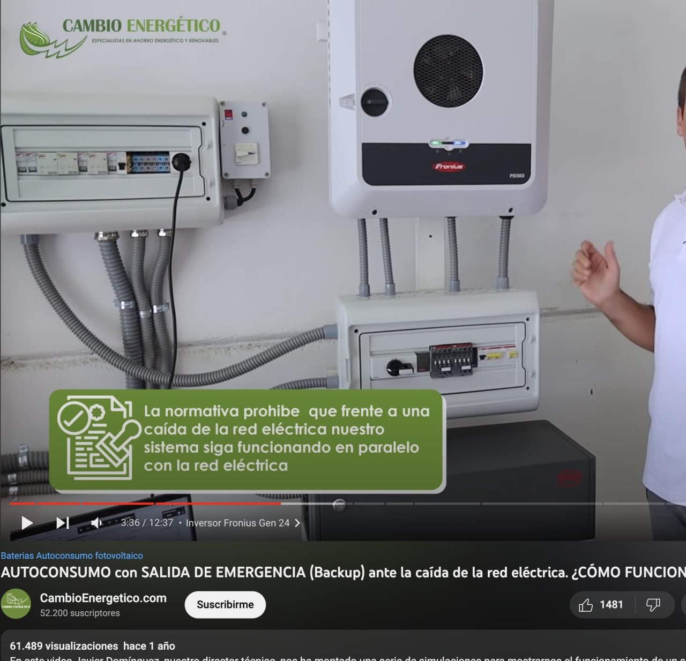
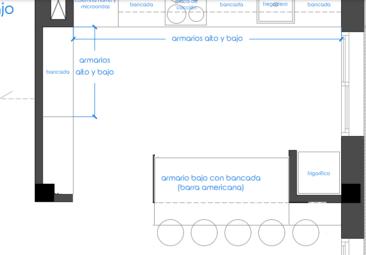

<!-- TOC -->

- [Dudas generales](#dudas-generales)
- [Planta baja](#planta-baja)
  - [General](#general)
    - [Dudas](#dudas)
  - [Patio delantero](#patio-delantero)
    - [Dudas](#dudas-1)
  - [Recibidor](#recibidor)
    - [Dudas](#dudas-2)
  - [Estudio](#estudio)
  - [Baño planta baja](#baño-planta-baja)
  - [Salón](#salón)
    - [Dudas](#dudas-3)
  - [Cocina](#cocina)
    - [Dudas](#dudas-4)
  - [Terraza trasera](#terraza-trasera)
  - [Piscina/Jardin](#piscinajardin)
    - [Dudas](#dudas-5)
  - [Trastero](#trastero)
    - [Dudas](#dudas-6)
- [Planta alta](#planta-alta)
  - [General](#general-1)
  - [Matrimonio](#matrimonio)
    - [Baño insuite](#baño-insuite)
      - [Dudas](#dudas-7)
  - [Baño común](#baño-común)
    - [Dudas](#dudas-8)
  - [Habitacion junto matrimonio](#habitacion-junto-matrimonio)
  - [Habitación sobre estudio](#habitación-sobre-estudio)
  - [Habitacion sobre entrada](#habitacion-sobre-entrada)
- [Tejado](#tejado)
  - [Dudas](#dudas-9)
- [Datos](#datos)
  - [Aislamiento suelo](#aislamiento-suelo)
  - [Raices pino  parcela cercana](#raices-pino--parcela-cercana)
- [Materiales](#materiales)
  - [Baños](#baños)
  - [Cocina](#cocina-1)
  - [Interiores](#interiores)
  - [Suelo](#suelo)
    - [Parquet](#parquet)
    - [Piscina](#piscina)
    - [Porche](#porche)
  - [Ventanas](#ventanas)
  - [Piscina](#piscina-1)
  - [Aerotermia](#aerotermia)
- [Armarios](#armarios)

<!-- /TOC -->

# Dudas generales

- Que las placas de pladur de las paredes lleguen hasta el techo, no sólo al falso techo para aislar ruidos

- ❓ Domótica
  - Nos comenta el electricista que se hablará con la persona que lo lleva cuando la obra esté más adelantada.

- Qué ventanas son?
  - tipos:
    - correderas (salón? , cocina?) 
    - oscilobatientes (despacho?, trastero? habitaciones sin balcón? )
    - puertas

  - Según tipo de ficha materiales
    - Correderas
    - Corredera Elevable
    - Practicable

- Cuadro para full backup automático placas solares Fronius
  - ¿Ubicación?
  - 

# Planta baja

- 
- 

## General

- ✔️ Airzone planta baja

### Dudas

- ❓ Foseado led con llave adicional en pasillos
  - 

## Patio delantero

- ✔️ Puerta de garaje automática
- ✔️ Toma de manguera
- ✔️ Enchufe exteriores
- ✔️ Preinstalación para poner cargador de coche eléctrico (corrugado hasta el cuadro, etc.). Punto cerca del medio de la fachada, centrado en la zona de aparcamiento.
- ✔️ Descalcificador
  - El descalcificador va en la esquina de la entrada del garaje.
- ✔️ Caja estanca en techo porche delantero, esquina más cercana a puerta entrada de la calle
  - ✔️ Cable RJ45 dentro de la caja estanca hasta el switch

### Dudas

- ❓ Protección para el descalcificador que no esté a la intemperie y almacenamiento de la sal?
- ❓ La puerta automática lleva sensor para no cerrarse si hay vehiculo pasando?

## Recibidor

- ✔️ Cajas MUY grandes para cuadro eléctrico y red
  - Con espacio para electrónica de red (conversor de medios, router operadora, router, switch, NVR, etc)
  - Enchufe en rail para poder conectar una regleta con los dispositivos anteriores
    - 
  - Conexión a la red telefónica RJ11 de la casa (para conectar al router)
- ✔️ Armario bajo escalera con puertas grande como las de la casa a ras de suelo
    - 🔌 Enchufe en el interior de este armario que da acceso al espacio diáfano

- ✔️ Cable RJ45 en techo junto a escalera hacia zona salón para AP
- ✔️ 🔌 Enchufe en la parte baja de la pared alineada con la puerta (aspirador)
- ✔️ Enclufe incluido (lámpara) en llave doble con interruptor conmutado
- ✔️ Videoportero con Wifi

### Dudas

- ❓ ¿Cómo son los barrotes de la escalera? ¿Cómo es en el rellano superior el 'hueco'? ¿Cómo es la estética de la escalera en general?
- ❓ Videoportero en pared junto a cocina
  - Enchufe para Alexa

## Estudio

- Quitar reja
- ✔️ Persiana eléctrica de seguridad
- ✔️ Armario empotrado como habitación de la planta superior
- ✔️ 🔌 Toma adicional de teléfono
- ✔️ 🔌 Toma adicional de RJ45
- ✔️ 🔌 Enchufes adicionales en mesa

## Baño planta baja

- ✔️ Bidet
- ✔️ Girar plato de ducha y hacer baldas en el hueco de la columna
  - 
  - 
- ✔️ Toalleros bajo pila
  - 
- ✔️ Tapa water retardada
- ✔️ Tapa bidet retardada
- ✔️ Espejo antivaho
- ✔️ Monomando integrado en pared + ducha de mano
- Mueble con luces nocturas por movimiento
  - 

## Salón

- ✔️ Persiana eléctrica de seguridad

### Dudas

- ❓ Mover conmutador luces pasillo al lado de la columna que no está en la cocina, más hacia el recibidor
- ❓ Foseado led con llave adicional
  - 

## Cocina

- ✔️ Persiana eléctrica de seguridad
- ✔️ mover placa hacia el centro
- Mover fregadero hacia la zona de la puerta y poner uno más ancho
- De los 4 enchufes, poner uno a cada lado de la placa y mover los otros dos, a la zona de la mesa, uno a poca altura sobre ella (thermomix,movil, etc) y otro altura más elevada para marco Alexa
- ✔️ Luces bajo muebles del banco (pared de aguas y la otra)
  - Interruptor junto a enchufes para activar las luces bajo mueble
- ✔️ Hendidura antigoteo el canto de la encimera (rebaje por la parte inferior)
- ✔️ Osmosis con grifo doble en 1 caño
- Electrodomésticos en blanco de cristal (microondas, horno)
- Lavavajillas panelado
- Cocina abierta como estamos hablando con Elena
  - 
  - Rellenar columna esquina comedor para que el murete haga que el mueble sea 'recto' en lugar de tener que recortarlo

### Dudas

- ❓ toma TV junto a columa extractores y enchufe
- ❓ Mover interruptor conmutada junto a enchufe cerca de la pila por si se entra desde la terraza
- ❓ 2 enchufes en la zona de mesado del mueble junto a nevera

## Terraza trasera

- ✔️ Zona de lavanderia
  - ✔️ Aerotermia 150L propuesta por Heliodoro
  - ✔️ Sacar lavadora
  - ✔️ Sacar Secadora
  - ✔️ Pila
  - ✔️ Armario corredera con llave para cerrar zona lavandería
- ✔️ Caja estanca en parte central del porche, alineada con puerta trastero
  - ✔️ Cable RJ45 hasta switch
- La luz exterior que tenga llave en la cocina, en el salón y en la pared donde está situado el punto de luz para iluminación.
- Añadir otra llave doble al lado a dos puntos de luz en el techo.
  - Una para antimosquitos
  - Otra para calefactores

## Piscina/Jardin

- ✔️ Desplazar piscina hacia el trastero dejando el hueco para caseta depuradora y ducha
  - 
- ✔️ Caseta depuradora enterrada
- ✔️ Depuración salina
- ✔️ ducha solar 18L
  - Desagüe haciendo curva el suelo:
  - 
- ✔️ Mantener jardín en zona más cerca a la casa
- ✔️ Quitar jardín en la zona más cercana al trastero (depuradora + ducha solar)
- Añadir llave conmutada para las luces del jardin en el trastero
- Añadir toma de corriente en la pared de cerca del jardin (cerca de toma de agua)

### Dudas

- ❓ Ubicación toma de agua para plantas, etc (preferencia en esquina de zona ajardinada, en el pasillo que va hacia el trastero)
- ❓ Ubicación desagues en terraza para evitar inundaciones
- ❓ Suelo de baldosa antideslizante
- ❓ Corrugado para instalación de luces en pared opuesta que llegue hasta el cuadro eléctrico
- ❓ Poner azulejos 'grandes' en lugar de gresite
  - 

## Trastero

- ✔️ Aislamiento
- ✔️ Persiana eléctrica de seguridad
- ✔️ Toma RJ45 en el interior desde la casa
- ✔️ Toma RJ45 en el exterior para cámara (caja estanca, corrugado, etc)
- ✔️ Aire acondicionado
- ✔️ Puerta cortafuegos
- Punto de luz sobre la ventana, conmutado con el de la pared lateral hasta el porche cubierto
- Enchufe en cada pared

### Dudas

- ❓ Suelo de baldosa

# Planta alta

## General

- ✔️ Airzone planta alta
- Telefonillo portero en la pared del baño
- ✔️ Cable RJ45 en techo junto a escalera hacia zona salón para AP
- Enchufe para Alexa

## Matrimonio

- ✔️ Persiana eléctrica de seguridad

### Baño insuite

- ✔️ Bañera en lugar de plato
- ✔️ Toalleros bajo pila
- ✔️ Enchufe para toallero eléctrico
- ✔️ Tapa water retardada
- ✔️ Tapa bidet retardada
- ✔️ Espejo antivaho
- Mueble con luces nocturas por movimiento
  - 

#### Dudas

- Monomando integrado en pared + ducha de mano ¿? (por la bañera)
  - 
  - 

## Baño común

- ✔️ Bidet
- ✔️ Toallero bajo pila
- ✔️ Enchufe para toallero eléctrico
- ✔️ Tapa water retardada
- ✔️ Tapa bidet retardada
- ✔️ Espejo antivaho
- ✔️ Monomando integrado en pared + ducha de mano
  - 
  - 
- Mueble con luces nocturas por movimiento
  - 

### Dudas

- Corredera de cassete para puerta baño?
- Enchufe en la zona actual de apertura de la puerta para toallero eléctrico

## Habitacion junto matrimonio

- ✔️ Persiana eléctrica de seguridad

## Habitación sobre estudio

- ✔️ Persiana eléctrica de seguridad
- Enchufes como en estudio?

## Habitacion sobre entrada

- ✔️ Persiana eléctrica de seguridad

# Tejado

- ✔️ Instalación de 13 placas solares con Fronius
- Caja estanca para el tubo
- Tubo corrugado del 5 o lo que sea para pasar cables al cuadro eléctrico para a futuro poder pasar cable de red o punto de luz  (estación metereológica, etc)
- Poner argollas a modo de escalera para subir terraza desde zona de porchado

## Dudas
- ❓ Confirmación de modo full backup automático

# Datos
## Aislamiento suelo
Hay varias soluciones para la humedad. El forjado sanitario es para para la humedad que actualmente normalmente  lo sustituye o bien con: solera de hormigón sobre encofrado perdido de módulo de polipropileno o como lo plantea la arquitecta que además de aislar la humedad se consigue un gran aislamiento térmico

En nuestro caso actualmente hay una solera de hormigón entre 15 y 20 com de espesor que esta sobre una capa de asfalto de unos 7 cm de espesor. Con lo cual ya hay una doble capa. Las humedades en viviendas antiguas es porque solo tienen una solera de hormigón entre el terreno y el pavimento

La solución del proyecto es sobre la doble capa actual: Barrera de vapor de oxiasfalto, lámina de polietileno, placa AIR-BUR XPS entre 60 y 80 mm y sobre esta solera de hormigón de entre 10 y 18 cm. de espesor, armada con mallazo para finalmente acabar con el pavimento porcelánico colocado con cemento cola. Con la que se consigue además de aislamiento de la humedad más aislamiento térmico del envolvente total de la vivienda.  Evidentemente cumpliendo de sobra la normativa actual y para intentar conseguir la máxima eficiencia energética  que añadiendo las placas solares  se prevé A en emisiones de carbono y A en consumo de energía.

## Raices pino  parcela cercana
En cuanto a las raíces no se observa ninguna afección en nuestra parcela ni creo que afecte en un futuro teniendo en cuenta que la valla y la edificación medianera con los vecinos va sobre una cimentación de hormigón que las raíces no pueden pasarla.

# Materiales
## Baños
 - Sanitarios: Roca, unisan o similar blanco
 - Grifería: FLAT-TRES
 - Mueble: Riesi
 - Pavimento: Pamesa
 - Principal: Alicatados: 36x80 Muren Nacar combinado con Muren Dec Gris
 - Secundarios: 30x90 alba arena y alba Relieve

## Cocina
- Griferia monomando Roca
- Pavimento Pamesa
- Encimera FBT Quartz

## Interiores
- Suelo planta baja: AT. Viggo de Pamesa
## Suelo
### Parquet
- [CLIPARQUET](CLIPARQUET.pdf)
- [Gold laminate](GOLDLAMINATE.pdf)
###  Piscina
  - Perimetral: Benesol Natural

  
### Porche
- Benesol Natural
## Ventanas
- [Practicable](Practicable.pdf)
- [Corredera](CorrederaEvolucion.pdf)
- [CorrederaElevable](CorrederaElevable.pdf)
## Piscina
- [Caseta fibra](casetafibra.pdf)
- Ducha solar BEHQ 18 Litros
  - 
## Aerotermia
- [Thermor Aeromax 150](ficha-aeromax-vm-es-2021.pdf)

# Armarios
- 